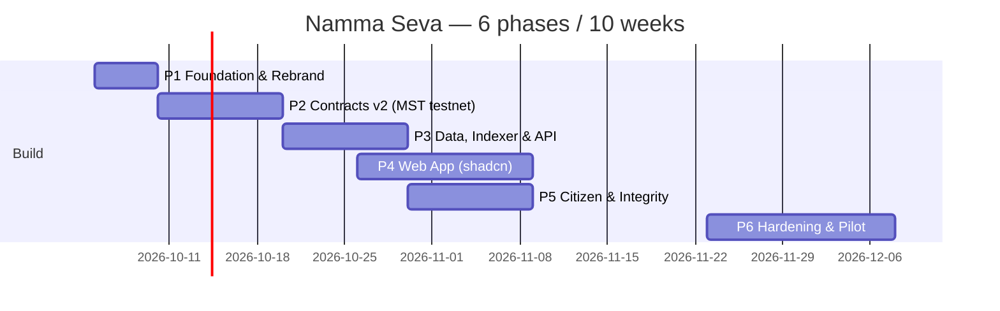

# Namma Seva — 6-Phase Delivery Plan

> Derived from [NAMMA_SEVA_IMPLEMENTATION_PLAN.md](../NAMMA_SEVA_IMPLEMENTATION_PLAN.md).
> Reference codebase: `~/Developer/DecentraliTrack` (pnpm monorepo, Polygon Amoy MVP).
> Target chain: **MST Blockchain** — testnet `91562037`, mainnet `4646`.

## Scope decisions

- **Web only.** No native mobile / Expo / React Native track. The DecentraliTrack workspace pins `react: 19.1.0` "because expo requires it" — that constraint is dropped. Mobile users are served by a responsive **PWA**.
- **UI = shadcn/ui** (style `new-york`, Tailwind v4, CSS variables, Radix primitives, `lucide-react`), same as `artifacts/decentralitrack/components.json`. New screens are composed from shadcn components; no second component library.
- **No team-allocation section.** Phases are organised by deliverable, not by headcount.
- Replit tooling (`@replit/vite-plugin-*`, `.replit`, `replit.md`, `bricklayer/`, `artifacts/mockup-sandbox`) is not carried over.

## Phases at a glance

| # | Phase | Weeks | Output | Depends on |
|---|---|---|---|---|
| 1 | [Foundation & Rebrand](PHASE_1_FOUNDATION.md) | 1 | Monorepo skeleton, shadcn web shell, MST chain package, ADRs | — |
| 2 | [Smart Contracts v2 on MST Testnet](PHASE_2_CONTRACTS.md) | 2–3 | Audited-ready contracts deployed + verified on testnet.mstscan.com | 1 |
| 3 | [Data Layer, Indexer & API](PHASE_3_BACKEND.md) | 4–5 | Postgres read model, reorg-safe indexer, SIWE/OTP auth, relayer | 2 |
| 4 | [Web App (shadcn), Wallets & i18n](PHASE_4_WEB.md) | 4–6 | Role dashboards, wallet-signed flows, kn/ta/hi/en, PWA | 1, 2 (ABIs); 3 for live data |
| 5 | [Citizen, Integrity & Anomaly Features](PHASE_5_FEATURES.md) | 6–7 | Grievances, tenders, proof checks, anomaly v2, open data | 3, 4 |
| 6 | [Hardening, DevOps & Pilot](PHASE_6_HARDENING.md) | 8–10 | Security audit, CI/CD, monitoring, ward pilot, mainnet | 5 |

**Demo checkpoint:** end of Phase 2 (week 3) — full project lifecycle on MST testnet, visible on mstscan.

## Definition of Done (applies to every phase)

- Contracts: tests + NatSpec + gas snapshot + Slither clean + deployed & verified on MST testnet.
- API: OpenAPI updated first, zod + client regenerated, integration test, logs/metrics.
- UI: built from shadcn components, all 4 languages, responsive down to 360 px, axe clean, E2E where a tx is involved.
- Docs: README / runbook / ADR updated.
